<!-- Typing header -->

  

  <a href="https://komarev.com/ghpvc/?username=puffynNeroun?_=1760290029?_=1760290653?_=1760291365?_=1760293163?_=1760294541?_=1760296274?_=1760296986?_=1760297759?_=1760298529?_=1760300148?_=1760301413?_=1760302149?_=1760303570?_=1760304388?_=1760305005?_=1760305763?_=1760307200?_=1760308209?_=1760309350?_=1760332585?_=1760334009?_=1760336732?_=1760338234?_=1760339784?_=1760341100?_=1760341747?_=1760343774?_=1760345310?_=1760347164?_=1760348533?_=1760350721?_=1760352224?_=1760354008?_=1760354863?_=1760355518?_=1760356177?_=1760358769?_=1760361520?_=1760363132?_=1760364995?_=1760366519?_=1760368554?_=1760369931?_=1760370579?_=1760372361?_=1760373857?_=1760375641?_=1760376648?_=1760377733?_=1760379689?_=1760381169?_=1760382722?_=1760383452?_=1760384172?_=1760384934?_=1760386655?_=1760387917?_=1760388569?_=1760390003?_=1760390780?_=1760392134?_=1760393665?_=1760394713?_=1760395758?_=1760418900?_=1760419958?_=1760420955?_=1760423036?_=1760424493?_=1760426172?_=1760427439?_=1760428166?_=1760429971?_=1760431469?_=1760432136?_=1760433530?_=1760434833?_=1760437025?_=1760438566?_=1760440381?_=1760441230?_=1760441884?_=1760442555?_=1760445271?_=1760447934?_=1760449541?_=1760451418?_=1760453000?_=1760453625?_=1760455066?_=1760456402">
    
  </a>
  
  

# 👋 Hi, I'm Aleksandr Teslia  
**Full-stack Developer** — React / Next.js / Node / Nest  

I build fast, scalable web apps using **Next.js 15 (RSC, Server Actions)**, **TypeScript**, and **Prisma/PostgreSQL**.  
Focused on **performance, clean architecture, DX, and automation.**

- **Current focus:** RSC, Server Actions, TanStack Query v5  
- **Side projects:** [Dota Helper AI](https://github.com/puffynNeroun/dota--helper) · [Sushi E-commerce](https://github.com/puffynNeroun/delivery-back)  
- **Stack:** React 19, Next.js 15, Node/Nest, Prisma, Supabase, Tailwind, shadcn/ui, Docker, Vercel/AWS  
- **Contacts:** [Telegram](https://t.me/lilerrpamp) · [Email](mailto:rememberfox00@gmail.com)

---

### ⚒️ Tech Toolbox

---

### 📈 GitHub Insights

  

  <!-- streak (стабильный виджет) -->
  

<!-- Activity Graph (fallback visual life) -->

---

### 🚀 Recent Projects
- **Dota Helper AI** — Next.js 15, Server Actions, Prisma/PostgreSQL, Redis. _Real-time picks, p95 ~180ms._ → [Code](https://github.com/puffynNeroun/dota--helper)
- **Sushi E-commerce** — React+Vite, Node/Express, Supabase, SBIS payments. _Checkout completion ↑._ → [Code](https://github.com/puffynNeroun/delivery-back)
- **Admin Panel** — Next.js 15, Server Actions CRUD, NextAuth, Redis, Playwright e2e. _Bundle −35% via route-level split._ → [Code](https://github.com/puffynNeroun/resume-assistant)

---

### 🏆 GitHub Achievements

  

---

<!-- ACTIVITY:START -->
_Last update: initializing..._
<!-- ACTIVITY:END -->

<!-- ACTIVITY:STATE
DATE=
COUNT=0
TARGET=0
ACTIVITY:STATE -->

---

### 🧭 About Me  
I turn ideas into **production-ready, measurable results** — balancing **speed, structure, and developer experience**.  
Currently exploring **RSC patterns, edge deployments, and AI-assisted DX tools**.

---

  Built by <a href="https://github.com/puffynNeroun">Aleksandr Teslia</a> — automation, clean architecture, strong DX.

